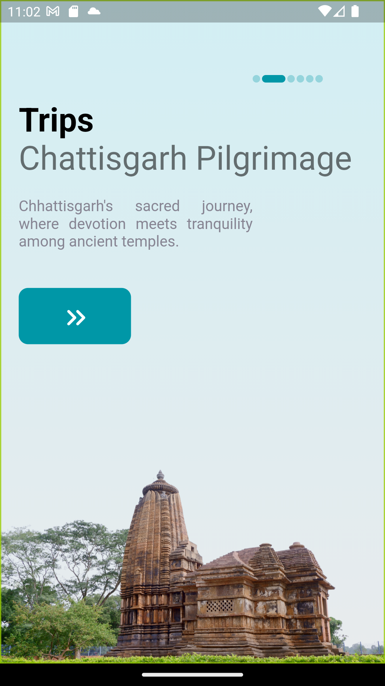

# Mor Chhattisgarh - Tourist Guide App

Mor Chhattisgarh is a Flutter-based mobile application designed to serve as a comprehensive tourist guide for the beautiful state of Chhattisgarh, India. The app aims to help tourists explore both popular and hidden gems, providing information about tourist attractions, routes, nearby hotels, and user reviews.

## 📝 Features

- **Explore Beautiful Places:** Discover the most enchanting tourist spots in Chhattisgarh.
- **Route Guidance:** Get detailed navigation instructions to reach your desired destination.
- **Hotel Recommendations:** Find nearby hotels with various options for your stay.
- **User Reviews:** Read and leave reviews to share your experiences with fellow travelers.

## 📸 Screenshots

     
   
     
 
   

## Installation

### ✅ Prerequisites

- Flutter installed on your machine. [Flutter Installation Guide](https://flutter.dev/docs/get-started/install)

### Steps to Install

1. Clone the repository to your local machine:

   ```
   git clone https://github.com/your-username/mor-chhattisgarh.git
   ```

2. Navigate to the project directory:
   ```
   cd mor-chhattisgarh
   ```
3. Install dependencies:
   ```
    flutter pub get
   ```
4. Run the app:
   ```
    flutter run
   ```

   *Ensure you have a connected device (emulator or physical device) or use the --device flag for web.*

   ## 🤝 Contributing

Found a bug? 🐛
Want to add a cool new feature? 🤔

Your contributions can help improve the WhatsApp Flutter UI project and make it even better.✨

<hr>
<p align="center">
Contributions  are welcomed from all developers!❤️
</p>
